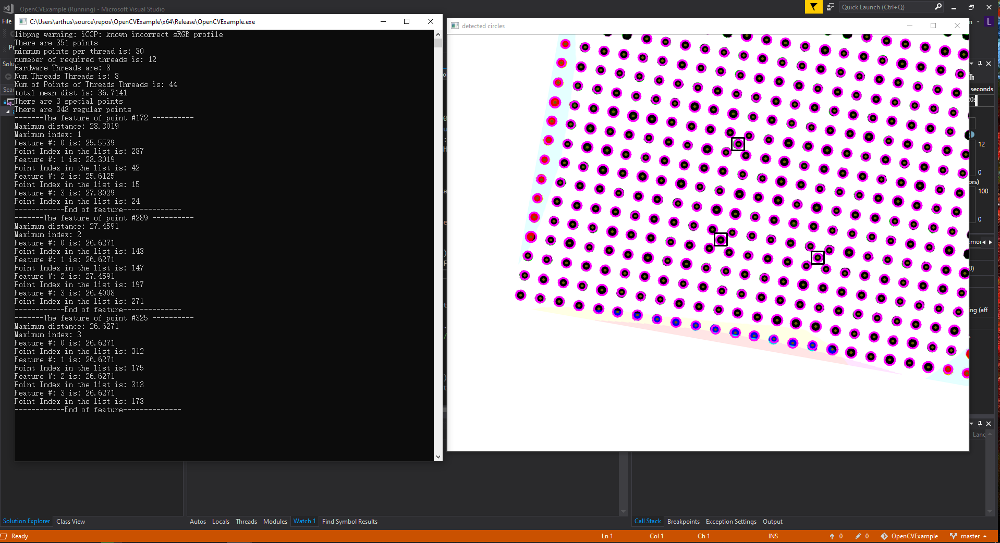

# Special point detection code
## How to run the program

> 1. Open OpenCVExample.sln to see the project
> 2. The main program is the main.cpp. find_points.cpp is not used. 
> 3. Before compiling, make sure that all opencv 4 libs are properly added (if you have a problem in compiling, please let me know)
> 4. Define Marco THREAD to enable multi-threading feature

## Algorithm explaination

> 1. The algorithm uses circular hough transform to detect the dots in the calibration image.
> 2. Then for each point, calculate its distance to every other points and record the least 4 values.
> 3. Assume that the number of special points is much less than the number of regular points so the average of the least distance between two points is approximately the grid size 
> 4. If both the maximum and minimum least distance of a point to other points are smaller than the grid size by a theshold, then the point is a special point.
> 5. The minimum distance between each point is provided by k-d tree search algorithm

## You may also open results.PNG to view the result

